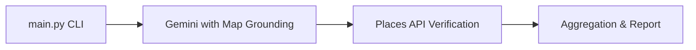

# Google Maps Grounding & Google Places API 2-Stage Verification Framework

This project is a 2-stage Point-of-Interest (POI) discovery and verification evaluation framework. It evaluates Gemini's performance under structured JSON output constraints with Google Maps Grounding enabled, and verifies the generated locations against live Google APIs to detect and quantify hallucinations.

---

## 🗺️ Process Workflow



---

## 🏗️ Architecture & Components

The framework is structured as follows:

```
├── main.py                # Pipeline entry point & orchestrator
├── util/
│   ├── __init__.py        # Utility package marker
│   ├── evaluator.py       # Stage A: Vertex AI Gemini caller with Maps Grounding
│   ├── verifier.py        # Stage B: Live Places API & CID verification routing
│   └── analyzer.py        # Metrics aggregator & Markdown report generator
├── reports/               # Directory for generated reports (e.g., full_evaluation_report.md)
└── results/               # Directory for raw JSONL evaluation outputs
```

### 1. `main.py`
The CLI orchestrator for running evaluations. It automatically:
- Cleans up past cached runs.
- Executes Stage A (Gemini generation) and Stage B (Places API validation).
- Triggers the statistical parser to compile markdown reports.

### 2. `util/evaluator.py` 
- Prompts Gemini models using Vertex AI with Google Maps Grounding enabled.
- Enforces a strict JSON output schema containing a `PlaceId` field.

### 3. `util/verifier.py` 
- Live verification of generated IDs.
- **Dynamic Routing**: Parses the generated ID.
  - If the ID is an alphanumeric **Place ID** (e.g., `ChIJ...`), it queries the **New Google Places API (v1)** Details endpoint.
  - If the ID is a numeric **CID** (e.g., `17004396853142544051`), it queries the **Legacy Google Places Details API** using the `cid` parameter.
- Performs a fuzzy string-matching validation between the model-generated title and the official API-resolved place name.

### 4. `util/analyzer.py` (Reporting)
- Aggregates raw output logs.
- Compiles the final Markdown evaluation report detailing overall latencies, verification rates, and a detailed **Place ID Verification Registry** table (highlighting `-- INVALID ID --` placeholders for failed resolutions).

---

## 📊 Key Metrics Tracked

- **Gemini Call Latency (s)**: Average time for Gemini to execute Google Maps Grounding and return the structured JSON.
- **Places API Call Latency (s)**: Average time to verify all generated Place IDs / CIDs in parallel via the Google Places Details API.
- **Grounded Rate (%)**: Percentage of runs that successfully included search grounding metadata.
- **Verification Rate (%)**: Percentage of generated places where:
  1. The generated Place ID resolves successfully to a real Google listing (`OK` status).
  2. The fuzzy match score between the generated place name and the retrieved place name is $\ge 85\%$.

---

## 🔍 Default Evaluation Queries

The framework is configured with a default set of 5 diverse Point-of-Interest (POI) queries:
1. `"Best street food spots and street food markets in Hanoi"`
2. `"Best vegan restaurants in Berlin"`
3. `"Top art museums and galleries in Paris"`
4. `"Hidden specialty coffee shops in Tokyo"`
5. `"Best rooftop bars with a view in Bangkok"`

---

## 📈 Benchmark Results

Here is the consolidated metrics summary from the latest full evaluation run:

| Model                             |   Runs | Avg Gemini Call Latency (s)   | Avg Places API Call Latency (s)   | Grounded Rate (%)   |   Total Places |   Verified Places | Verification Rate (%)   |
|-----------------------------------|--------|-----------------------|---------------------------|---------------------|----------------|-------------------|-------------------------|
| **gemini-3.1-flash-lite**         |     25 | 5.39s                 | 0.57s                     | 0.00%               |            130 |               125 | 96.15%                  |
| **gemini-3.1-flash-lite-preview** |     24 | 5.40s                 | 0.56s                     | 100.00%             |            122 |               107 | 87.70%                  |

For the complete place-by-place validation registries, see the [Full Evaluation Report](reports/full_evaluation_report.md).

---

## 🛠️ Setup & Requirements

### 1. Prerequisites
- Python >= 3.13
- [uv](https://github.com/astral-sh/uv) (Python package manager)

### 2. Environment Configuration
Copy `.env.example` to a new `.env` file in the root directory:
```bash
cp .env.example .env
```
Fill in the configuration variables in `.env`:
- `PROJECT_ID`: Your Google Cloud Project ID.
- `LOCATION`: Vertex AI location (e.g., `global` or `us-central1`).
- `PLACES_API_KEY`: A valid Google Maps Places API credential key.
- `GOOGLE_API_USE_CLIENT_CERTIFICATE`: Set to `false` to bypass mTLS checking on macOS.

---

## 🚀 Execution Instructions

### 📥 Install Dependencies
```bash
uv sync
```

### ⚡ Quick Dry Run (Single Query)
To run a fast validation test to verify API keys and credentials:
```bash
uv run python main.py --quick
```
This writes raw logs to `results/quick_test_results.json` and compiles a metrics summary report at `reports/quick_test_report.md`.

### 🏆 Full Evaluation Run
To run the full evaluation suite, you do not need to pass any command-line parameters:
```bash
uv run python main.py
```
By default, the pipeline runs with the following settings:
- **Models**: `["gemini-3.1-flash-lite-preview", "gemini-3.1-flash-lite"]` (evaluates both models sequentially)
- **Repetitions**: `5` runs per query/model config (totaling `50` evaluation iterations)
- **Thinking Effort**: `"low"`
- **Concurrent Workers**: `3` threads

This writes raw outputs to `results/full_eval_results.json` and compiles the final report at `reports/full_evaluation_report.md`.
